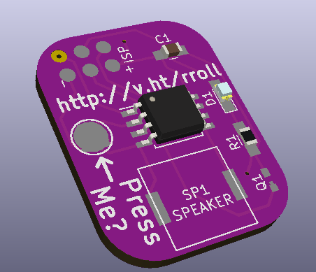

Introduction
============

 

I came across an [interesting article](http://cornellsun.com/2017/11/10/hundreds-rickrolled-in-mysterious-campus-prank-at-cornell/) about someone placing Attiny coin cell based "Rick Roll" devices around a college campus. I've been "Rick Rolling" student for years with my [Snap-n-sew Kit](https://www.tindie.com/products/MakersBox/snapnsew-kit-a-soft-circuit--embedded-platform/), so it was quite easy to strip that project down, switch to surface mount components, and put it on a footprint encompasing the size of a CR2032 battery.

I also came across this [similar project](https://github.com/rogertheriault/firefly) that chirps and blinks at intervals.  My idea is to use sound/light to attract attention to the device and then have the victim press a button to activate the Rick Roll.

Bill Of Materials
=================
  
- 1 ea. Perfect Purple PCB from OSH Park, https://oshpark.com/shared_projects/lpA38MDw
- 1 ea., ATTINY 85 SOIC8, ATMEL ATTINY85V-10SURCT-ND, http://www.digikey.com/short/3253mp
- 1 ea., LED RED CLEAR 0805 SMD, Dialight 5988130107F, https://www.digikey.com/short/qjwthb
- 1 ea., RES SMD 330 OHM 5% 1/4W 0805, Yageo RC0805JR-07330RL, https://www.digikey.com/short/3wzz2f 
- 1 ea., CAP CER 0.1UF 50V X7R 0805, https://www.digikey.com/product-detail/en/kemet/C0805C104M5RACTU/399-1169-1-ND/411444
- 1 ea., AUDIO PIEZO TRANSDUCER 12.5V SMD, Murata PKMCS0909E4000-R1, https://www.digikey.com/short/qjn4nh
- 1 ea., AMBIENT LIGHT SENSOR, Everlight ALS-PT19-315C/L177/TR8, https://www.digikey.com/product-detail/en/everlight-electronics-co-ltd/ALS-PT19-315C-L177-TR8/1080-1244-1-ND/2675978
- 1 ea., HOLDER BATTERY 20MM COIN, Linx BAT-HLD-001, http://www.digikey.com/short/3rbvh8
- 1 ea. CR2032 Battery, Panasonic CR2032, Digikey P189-ND (requires ground shipping, or buy locally).

Design Files
============
This project is designed using Open Source [KiCad](http://kicad-pcb.org/). Design files are located in the [design_files](design_files/) folder.  You can oogle the [schematic](images/base.sch.png).

Firmware
========
This project is programed using the Open Source [Arduino](https://www.arduino.cc/). I use my Open Source [AVR Programming Shield](https://www.tindie.com/products/MakersBox/yet-another-programming-shield/) to program the Attiny85. The firmware is located in the [firmware](firmware/) folder.

Assembly Instructions
=====================
You are on your own for now . . .

License
=======
[Attribution-ShareAlike 3.0 United States (CC BY-SA 3.0 US)](https://creativecommons.org/licenses/by-sa/3.0/us/)

You are free to:

- Share — copy and redistribute the material in any medium or format
- Adapt — remix, transform, and build upon the material

Under the following terms:

- Attribution — You must give appropriate credit, provide a link to the license, and indicate if changes were made. You may do so in any reasonable manner, but not in any way that suggests the licensor endorses you or your use.
- ShareAlike — If you remix, transform, or build upon the material, you must distribute your contributions under the same license as the original.
