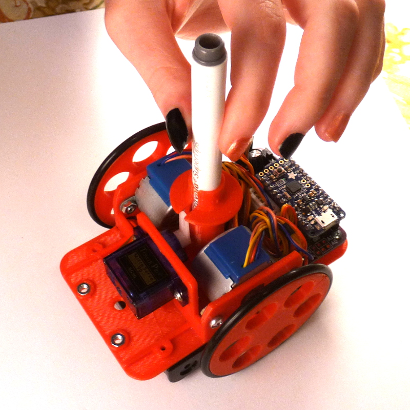

Introduction
============

 
I designed this project for a 10-hour workshop for ChickTech.org whose goal is to introduce teenage women to STEM topics. The goals for this project were:

- Easy to build.
- Easy to program.
- Did something interesting.
- Low-cost so participants could take it home and continue to learn.

With those goals in mind, here were a couple of the design choices:

- Arduino compatible for ease of programming.
- 4xAA battery power for cost and availability.
- Stepper motors for accurate motion.
- 3D Printed for ease of customization.
- Pen plotting with Turtle graphics for interesting output.
- Open Source so you could make one of your own!

See a [Show and Tell](https://youtu.be/j0FpB0iv0v0).

Bill Of Materials
=================

- See Assembly Instructions

Design Files
============
The electronics were designed using Open Source [KiCad](http://kicad-pcb.org/). Design files are located in the [design_files](design_files/) folder.  You can oogle the [schematic](docs/Schematic.pdf).

The 3D Design files are located in the [3D](3D/) folder.

Firmware
========
This project is programed using the Open Source [Arduino](https://www.arduino.cc/). The firmware is located in the [firmware](firmware/) folder.  Instructions for setting up the Arduino enviroment for the Adafruit Trinket Pro are at [https://learn.adafruit.com/introducing-pro-trinket](https://learn.adafruit.com/introducing-pro-trinket).

Assembly Instructions
=====================

- [Trinket Shield]<docs/Trinket Robot Instructions.odt>
- [Robot Chassis]<docs/Trinket Robot Shield Instructions.odt>
- [Customized Name Plate]<docs/Name Plate 3D Design.odt>

License
=======
[Attribution-ShareAlike 3.0 United States (CC BY-SA 3.0 US)](https://creativecommons.org/licenses/by-sa/3.0/us/)

You are free to:

- Share — copy and redistribute the material in any medium or format
- Adapt — remix, transform, and build upon the material

Under the following terms:

- Attribution — You must give appropriate credit, provide a link to the license, and indicate if changes were made. You may do so in any reasonable manner, but not in any way that suggests the licensor endorses you or your use.
- ShareAlike — If you remix, transform, or build upon the material, you must distribute your contributions under the same license as the original.
