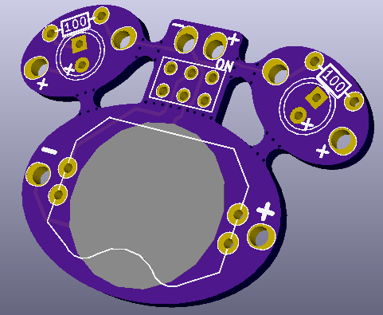

Introduction
------------

 
Just some LEDs, a battery, and a switch. Solder it up, test it, break it apart, and put it into a project!

Bill Of Materials
-----------------

- 1 ea., Perfect Purple PCB from OSH Park
- 1 ea., RETAINER BATT CR2025/2032, [Linx BAT-HLD-001-THM](https://www.digikey.com/short/jm51vr)
- 1 ea., DPDT Slide switch, [C&K JS202011AQN](https://www.digikey.com/short/jm511q)
- 2 ea., 100-ohm 1/8W resistor, [generic](https://www.digikey.com/short/jmrccc)
- 2 ea., 3 or 5mm LED, [generic](https://www.digikey.com/short/7hrvbp)
- 1 ea., (optional) Tie tack blank

Design Files
------------
The electronics were designed using Open Source [KiCad](http://kicad-pcb.org/). Design files are located in the [design_files](design_files/) folder.  You can oogle the [schematic](docs/Schematic.pdf).

Firmware
--------
None

Assembly Instructions
---------------------
TODO

License
-------
[Attribution-ShareAlike 3.0 United States (CC BY-SA 3.0 US)](https://creativecommons.org/licenses/by-sa/3.0/us/)

You are free to:

- Share — copy and redistribute the material in any medium or format
- Adapt — remix, transform, and build upon the material

Under the following terms:

- Attribution — You must give appropriate credit, provide a link to the license, and indicate if changes were made. You may do so in any reasonable manner, but not in any way that suggests the licensor endorses you or your use.
- ShareAlike — If you remix, transform, or build upon the material, you must distribute your contributions under the same license as the original.
