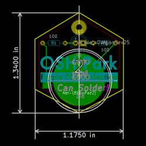
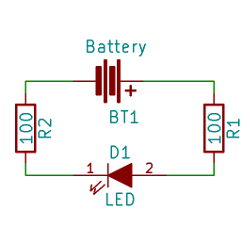

Introduction
============

 
 
 
A quick and easy "I Can Solder" badge project.

Bill Of Materials
=================
  
- 1 ea. SMD Battery holder, [Linx BAT-HLD-001](https://www.digikey.com/short/jz1cf5)
- 1 ea. 5 mm RGB Color changing LED, [Digikey](https://www.digikey.com/short/jzvzvb) or [Amazon](http://a.co/841utUf) 
- 2 ea. 100 ohm 1/8W Resistor, [Stackpole CF18JT100R](https://www.digikey.com/short/qq8mtn)
- 1 ea. CR2032 Battery, [Digikey](https://www.digikey.com/short/jzvzdq) or [Amazon](http://a.co/3KOiZ4U)
- 1 ea. 10mm Tie-tack pins with clutch back [Ebay](http://r.ebay.com/CVhwgo) 

Design Files
============
This project is designed using Open Source [KiCad](http://kicad-pcb.org/). Design files are located in the [design_files](design_files/) folder.  You can oogle the [schematic](docs/project.pdf).

Firmware
========
None.  The flashing LED handles all of the magic.

Assembly Instructions
=====================

- If you are a beginner, check out [SparkFun's Tutorial](https://learn.sparkfun.com/tutorials/how-to-solder-through-hole-soldering) and/or [Carrie Ann's video](https://youtu.be/P5L4Gl6Q4Xo).
- Start with the resistors as they have no polarity and are heat tolerant while you are getting a feel for it.
- The LED has a polarity and the long leg is the anode (positive) and goes in the hole marked "+".
- The battery holder is actual a surface mount part.  
  - Heat the gold pads and melt a little solder on to each side. 
  - Make sure the opening of the battery holder faces downward so you can get the battery in and out.
  - Heat the holders leg on top of the blobs till they melt down into it. 
  - Reheat to adjust alignment, and add more solder if necessary.
- The tie-tack is attached the same as the battery holder, although you may want something like tweezers to hold it as it gets hot fast.

License
=======
[Attribution-ShareAlike 3.0 United States (CC BY-SA 3.0 US)](https://creativecommons.org/licenses/by-sa/3.0/us/)

You are free to:

- Share — copy and redistribute the material in any medium or format
- Adapt — remix, transform, and build upon the material

Under the following terms:

- Attribution — You must give appropriate credit, provide a link to the license, and indicate if changes were made. You may do so in any reasonable manner, but not in any way that suggests the licensor endorses you or your use.
- ShareAlike — If you remix, transform, or build upon the material, you must distribute your contributions under the same license as the original.
